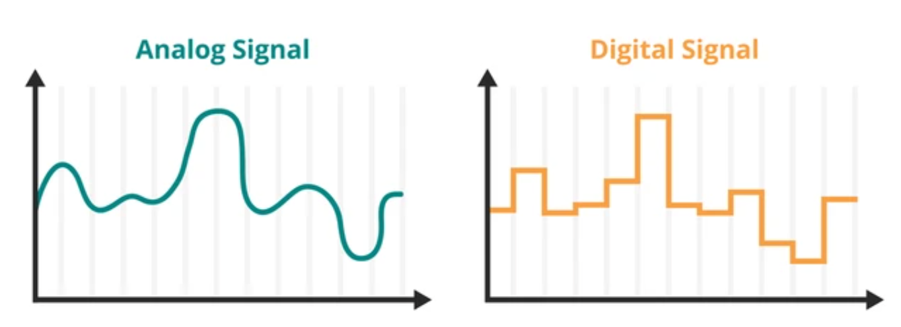

# 第一章 数制和码制
___

### 1.1 概述
1. 模拟电路和数字电路
* 模拟电路：处理时间上**连续**的信号，信号可以是任意幅度和频率的连续变化。
* 数字电路：处理**离散**信号，信号仅以两个离散状态表示（如0和1），常见于二进制表示。
  

___
_此部分内容参见  
**计算机科学概论/期末速通指南** 进制转换部分_
### 1.2 常用的数制
### 1.3 不同数制间的转换
### 1.4 二进制算数运算
___

### 1.5 几种常用的编码
1. 十进制代码
* 8421码：又称BCD码，广泛应用于数字显示器、计算机系统和一些数字电路中。  
  **编码规则：**  
  十进制转BCD码：每个十进制数（0-9）都可以用4位二进制数表示。  
  BCD码转十进制：每位的二进制数分别乘以对应权值（8、4、2、1），最后相加得出对应的十进制数字。
2. 格雷码
* 每一位的状态变化都按一定的规律循环，导致相邻两个代码之间只有一位发生变化。
* 具有**抗噪声能力强**、**误差较小**等特点。
3. 美国信息交换标准代码（**ASCII**）
* 一个字符由**7位**二进制数构成，共能表示128个字符（包括转译字符）。