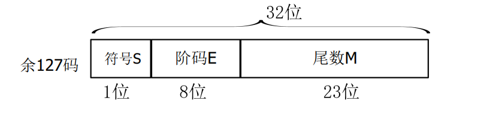
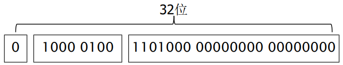
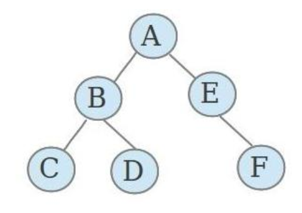

# 期末速通教程
###### 作者：*UE-DND*
###### 本教程仅为个人整理，必然会有疏漏或错误的内容，请仔细甄别。
##### 注意，用“==”包围的内容为重点。

## 一、计算工具的发展简史

###### 1. 世界上第一台大型电子计算机是==ENIAC==，发明于1946年，使用电子管。

###### 2. 各代计算机使用的主要器件

        (1) 第一代计算机——电子管
        
        (2) 第二代计算机——晶体管
        
        (3) 第三代计算机——集成电路
        
            注：
                i. 集成电路是将大量的晶体管和电子线路组合在一块硅片上，故又称为芯片。
            
        (4) 第四代计算机——大规模和超大规模集成电路
        
###### 3. ==冯·诺依曼体系结构==

        (1)控制单元(Control Unit)：负责解释和执行存储在内存中的指令，并控制其他组件的操作。

        (2)算术逻辑单元(ALU)：负责执行算术运算(如加法、减法)和逻辑运算(如比较大小、与或非操作)。

        (3)存储器(Memory)：用于存储数据和程序。在冯·诺依曼架构中，内存中同时存储指令和数据。

        (1)输入设备(Input Devices)：用于向计算机输入数据或指令，例如键盘、鼠标等。

        (1)输出设备(Output Devices)：用于将计算结果或信息输出到外部设备，例如显示器、打印机等。
---
## 二、计算机学科的根本问题
###### 1.==可计算问题==与不可计算问题

###### 2.易解问题（P问题）与难解问题

        • 可以在多项式时间内==求解==的问题看作易解问题。
        • 需要指数时间求解的问题看作难解问题。

###### 3.NP问题与NP完全问题

        • 可以在多项式时间内验证的问题看作NP问题。
        • 可以在多项式时间内得到验证，但不知道是否可以在多项式时间内得到求解或不能证明问题中的其中一个，称为NP完全问题。
---
## ==三、认识计算机的运算基础==

###### 1.计算机采用二进制的原因

        (1) 硬件实现简单；
        (2) 可靠性高,不容易受到干扰；
        (3) 逻辑运算简便；
        (4) 存储效率高。

###### 2.进位计数制

        (1) 不同的进制以基数来区分，若以 r 代表基数，则
            r = 10 为十进制，可使用0，1，2，……，9共10个数码；
            r = 2 为二进制，可使用0，1共2个数码；
            ……
        
        (2) 进位计数制采用位置计数法表示数
        
        (3) 位权值：对于r进制数，小数点左边的权位值依次为 r0 ，r1，… ，rn 。
                          小数点左边的权位值依次为 r-1，r-2，… ，r-m 。
                        
                    
                例如，十进制数198.63可以表示成：198.63 = 1×10^2 + 9×10^1 + 8×10^0 + 6×10^(-1) + 3×10^(-2)

###### 3.进制转换

        (1) 二进制与十进制

                • 二进制转十进制：将二进制数按位权值展开，再进行求和。

                    位权值展开，为 ___ × ___^m + ___ × ___^(m-1) + …… + ___ × ___^0 + ___ × ___^(-1) + …… + ___ × ___^(-n)  的结构。
                    将要展开的数各个位依次放在乘号左边，乘号右边的数字，为要展开的数的进制。
                    上标 m = 小数点前位数 -1；n = 小数点后位数
                    例如，1101.11 = 1×2^3 + 1×2^2 + 0×2^1 + 1×2^0 + 1×2^-1 + 1×2^-2

                • 十进制转二进制：将十进制分解为整数部分和小数部分，对两部分分别进行转换，然后相加得到结果。

                    ○ 整数部分

                    转换的规则为：对十进制数使用短除法(除与二进制的基数2)，将商数继续短除直至不能再除。
                    将所有短除后的余数，作为二进制的结果并逆序排列，即为转换后的二进制数。
                    例如，将十进制整数 46 转换为二进制整数：

除数	|商	|余数|
|:--:|:--:|:--:|
46	|23	|0
23	|11	|1
11	|5	|1
5	|2	|1
2	|1	|0
1	|0	|1

转换后结果为 101110 ，注意是逆序排列。

                ○ 小数部分

                转换的规则为：将十进制小数乘以二进制的基数2，然后将得到的积，小数点前的数(0或1)
                作为二进制的结果，并正序排列，直到积的小数部分为0。
                例如，将十进制小数 0.375 转换为二进制小数：

乘数	|积	|整数
|:--:|:--:|:--:|
0.375	|0.75|	0
0.75	|1.5|	1
0.5|	1.0	|1

转换后结果为 0.011 ，注意是正序排列。

                注：
                        i. 并不是所有十进制小数都可以精确转换为二进制小数。如果积的小数部分始终不为0，则可以根据精度要求舍弃。
    
            
        (2)二进制与八进制

                • 二进制转八进制：将二进制分解为整数部分和小数部分，对两部分分别进行转换，然后相加得到结果。
                
                    ○ 整数部分
                    
                    转换的规则为：从右向左，每三位一组进行分组。如果最左边不足三位，可以在左边补零。
                    将每组三位二进制数转换为对应的八进制数字。
                    
                    ○ 小数部分
                
                    转换的规则为：从左向右，每三位一组进行分组。如果最右边不足三位，可以在右边补零。
                    将每组三位二进制数转换为对应的八进制数字。
                    
                • 八进制转二进制：八进制的每一位可以直接转换为三位二进制数。
                        
                        
        (3)二进制与十六进制
                    
                • 二进制转十六进制：与以上转换类似，不同的是每四位一组进行分组。
        
###### 4.信息的编码

        (1) 整数的编码
    
                • 计算机中同一类型的数据具有相同的长度，与数据的实际长度无关。
                  假设某计算机系统中整数占2字节(即16位二进制)，则所有整数的长度都是16位。
                
                • 在计算机二进制数的表示中，原码、反码和补码是表示有符号整数的三种方式。
                  它们主要用于处理正负数的表示。
                
                    ○ 原码是最简单的有符号数表示方法。使用二进制的最高位(最左边位)表示符号，其余位表示数值大小。
                        规则：
                            符号位：最高位(最左边位)表示符号，0 表示正数，1 表示负数。
                            数值部分：其余位表示该数的绝对值。
                        例如，+5 的 8 位原码表示：0000 0101(符号位是 0，表示正数，后面的数值是5)；
                             -5 的 8 位原码表示：1000 0101(符号位是 1，表示负数，后面的数值是5)。
                                
                    ○ 反码
                        规则：
                            正数的反码与原码相同。
                            负数的反码：符号位不变，数值部分按位取反(0 变 1，1 变0)。
                        例如，+5 的 8 位反码表示：0000 0101(正数的反码和原码同)；
                             -5 的 8 位反码表示：1111 1010(符号位不变，其余位按位反)。
                            
                    ○ 补码
                        规则：
                            正数的补码与原码相同。
                            负数的补码：将负数的原码的数值部分按位取反，然后加 1(即：补码 = 反码 +1)。
                            补码转原码步骤相同。
                        例如，+5 的 8 位补码表示：0000 0101
                             -5 的 8 位补码表示：
                                            先求原码：1000 0101
                                            再求反码：1111 1010
                                            最后加 1：1111 1011
                               因此，-5 的 8 位补码为：1111 1011
                            
                        补码的优点是表示0的方式唯一，且方便进行算术运算。

                • 数据溢出的原因是要表示的数值，超过了系统能够表示的范围。
                    用补码方式表示n位带符号整数时，表示范围为 -2^(n-1) ～ 2^(n-1) - 1
                    在计算加减法时，注意可能会出现数据溢出的情况。先将两个数直接相加，若结果超出了n位带符号整数的表示范围，则溢出。
                    以下是溢出范围不大的简单计算方法：
                    正溢出的计算：(a1 + a2) - 256 = result 再转进制
                    负溢出的计算：(a1 + a2) + 256 = result 再转进制
        
        (2) 浮点数的编码

            浮点数：在日常生活中， 对于很大的数或很小的数， 必须用科学计数法来表示。
            小数点位置不固定， 称为浮点数。

            • IEEE754 标准表示法 (一种广泛使用的浮点数运算标准)
                以单精度格式为例,共用32位二进制来存储一个浮点数。
                其中，符号位占1位，(阶码指数)占8位(使用偏移量127)，尾数占23位(无符号数)，该标准也称为余127码。

                    ○ 单精度浮点数：32位，1位符号位，8位指数位，23位尾数位。
                    ○ 双精度浮点数：64位，1位符号位，11位指数位，52位尾数位。

                    

    例如，用IEEE754 标准表示十进制实数 58.0 ：

    ① 58.0 是整数，因此符号位 S 为0
    ② 将 58.0 写成二进制形式：111010.0 
    ③ 将二进制形式写成科学计数法形式：1.110100 × 10^5
    ④ 计算阶码 E = 5 + 127 = 132，阶码E的二进制形式为 10000100，填入阶码 E 中
    ⑤ 计算尾数 M = 1.110100，将小数点后的二进制数 110100 填入尾数 M 中，
      注意，此时的尾数 M 是规格化的，规格化的尾数的最高位为 1 ，因此舍去最高位的 1 ，得到 110100 填入尾数 M 中，其余位用 0 补齐。

        (3) 字符的编码

            • 标准ASCII码：大写字母转小写字母，ASCII码 + 32。

            • 扩展ASCII码

            • Unicode编码

        (4) 汉字的编码

            转换过程：输入设备  ————> 汉字输入码 ————> 汉字机内码 ————> 汉字字形码 ————> 输出设备

        (5) 图形和图像的编码

            存储量(字节)= 图像宽度(像素)× 图像高度(像素)× 采样位数(位)/8。

            注：
            在 RGB 颜色模式下，每个像素由红(R)、绿(G)、蓝(B)三个颜色通道组成。
            每个通道的颜色深度通常为 8 位，所以总的颜色深度为 24 位(8 位 ×3)。

        (6) 声音的编码

            存储量(字节)= 采样率(Hz)× 采样位数(位)× 声道数 × 时间(秒)/8。

###### 5. 逻辑电路

        (1) 门电路(基本)

            • 与门：输入A和B同时为1，输出为1，否则为0。

            • 或门：输入A和B中只要有一个为1，输出为1，否则为0。

            • 非门：输入A为1，输出为0，输入A为0，输出为1。

            • 异或门：输入A和B相同，输出为0，输入A和B不同，输出为1。

            • 与非门：先对两个输入进行与运算（输入A和B同时为1，输出为1，否则为0），然后将其结果取反。

            • 或非门：先对两个输入进行或运算（输入A和B中只要有一个为1，输出为1，否则为0），然后对结果取反。

        (2) 组合电路

            • 半加器

            • 全加器：考虑进位输入的加法电路成为全加器

        (3) 时序电路
        
            • S-R锁存器

###### 6. 计算机部件

        (1) 存储器

            地址空间： 所有在存储器中标识的独立的地址单元的总称。
            
            地址空间的计算：如果计算机内存有N个字的存储空间，那就需要有log2(N)位的二进制无符号整数来确定一个存储单元。

            • ==内存储器==
                内存储器有两种：
                    随机存储器RAM(Random access memory)，又称易失性存储器
                        RAM又分为静态随机存储器(SRAM) 和 动态随机存储器(DRAM)。
                    只读存储器ROM(Read only memory)，又称非易失性存储器。

            • ==高速缓冲存储器(Cache，简称缓存)==
                介于内存和CPU之间。位置可以在CPU芯片的内部， 也可以在CPU芯片的外部。
                注意：CPU缓存为SRAM

        (2) ==CPU的构成==
        
            • 总线

            • 运算器(ALU)
                主要由算术逻辑运算部件和寄存器组成。

            • 控制器
                构成：
                    程序计数器(ProgramCounter)：存放下一条要执行的指令的地址。
                    指令寄存器(IR)：存放当前正在执行的指令。
                    指令译码器(ID)：对当前指令进行翻译。
                    时序控制电路：提供计算机运行时间的节拍。
                    微操作控制电路：产生各种控制信号。

        (2) ==程序的执行过程==

            • 指令
                指令分为 操作码 和 操作数 两部分
                （注意，以下部分内容仅供通过测试，不一定符合实际情况）
                指令编码的头部为操作码，中间的数为寄存器编号，最后的数为存储单元编号。

                举例：（仅演示各个位置的含义，操作码具体功能题目应该会给）
                指令编码 156A，1 代表取出并装入操作，5 代表（要）装入的寄存器编号，6A代表（要）取出的存储单元编号；
                指令编码 306E，3 代表存放操作，0 代表（要）取出的寄存器编号，6E代表（要）存放的存储单元编号。
---
## 四、问题求解与程序设计

###### 1.==数据结构==

        (1) 主要的数据类型

            • 栈（抽象为一个容器，要想取出底部的东西，先把顶部的东西拿出来）
                栈的插入操作称为入栈，栈的删除操作称为出栈。不含任何数据元素的栈称为空栈。
                特点：先进后出，后进先出

            • 队列（抽象为一根管子，一端只能插入数据，另一端只能取出数据）
                特点：先进先出，后进后出（要排队）

            • 二叉树
                二叉树的遍历
                前序遍历
                中序遍历
                后序遍历

前序遍历：ABCDEF
中序遍历：CBDAEF
后序遍历：CDBFEA
            
###### 2.算法(Algorithm)

        (1) ==算法是对特定问题求解步骤的一种描述，是指令的有限序列。==

        (2) ==算法的特性==

            • 输入：一个算法有 0 个或多个输入。

            • 输出：一个算法有 1 个或多个输出。

            • 有穷性：一个算法必须在执行有限的步骤之后结束。

            • 确定性：算法的每一步骤都必须有确切的定义，对于相同的输入只能有相同的输出。

            • 可行性：算法的每一步骤都必须是可行的，也就是说，每一步骤都能够通过执行有限次数完成。

###### 3.程序语言

        (1) 程序设计语言的发展

            • 第一代程序设计语言——机器语言
            缺点：难以阅读和理解。
            • 第二代程序设计语言——汇编语言
            缺点： 不同机器的汇编指令不同，程序不能移植。

            • 第三代程序设计语言——高级语言
---
## 五、操作系统

###### 1. 操作系统的定义与发展

        (1) ==操作系统的定义==

            操作系统是一个程序集合，是系统软件的核心。

        (2) 操作系统的特征

            • 并发性
            • 共享性
            • 虚拟性
            • 不确定性

            ==并发性和共享性是操作系统的最基本特征。==

            Windows是单用户多任务分时系统。
        
        (3) 操作系统的工作方式

            中断——唤醒操作系统的唯一方式。

        (4) 内存管理

            ==划分内存的方法有两种：固定分区法 和 动态分区法==
---
## 六、应用软件

###### 1.软件工程

        (1) 软件测试

            • 白盒测试：也称为结构测试， 主要用于检测软件编码过程中的错误。

            • 黑盒测试：也称为功能测试，主要检测软件的每一个功能是否能够正常使用。 
---
## 七、计算机通讯与网络

###### 1.计算机通信

        (1) 信号分成两大类：数字信号和模拟信号。

            • 数字信号是一系列的脉冲，脉冲的状态只有两种，例如高电平和低电平。 

            • 模拟信号是一种连续变化的波，模拟信号的基本特征是频率和振幅。

        (2) 调制与解调

            • 把数字信号转换为模拟信号称为调制。

            • 把模拟信号转换为数字信号称为解调。

            • 完成调制和解调的设备叫做调制解调器， 也称为Modem（光猫）。

###### 2.==计算机网络==

        (1) TCP/IP协议集

            • 应用层
            • 传输层
            • 网络层
            • 物理层

        (2) IP地址的构成

            • 网络号：用于识别网络地址

            • 主机号：用于识别同一网络内的具体设备或主机

            一串IP地址的总长度 32 位（即 4 字节）。
            IP地址分为 4 个部分，每部分有 4 个十进制数字，每个数字代表 8 位二进制的值，==每个十进制数字的范围是 0 到 255。==

            IPv6 的优点：
            • 提供更多地址空间
            • 提供更强大的安全性
            • 传输速度更快

        (3) 统一资源定位器(URL)

            URL协议
            • FTP 文件传输协议
            • HTTP 超文本传输协议
            • USENET 网络信息服务

